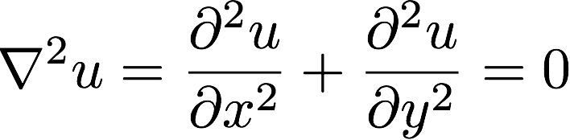

# The Laplace Equation
## Historical note
Laplace's equation is a second-order partial equation named after [Pierre-Simon, marquis de Laplace](https://en.wikipedia.org/wiki/Pierre-Simon_Laplace), a French scholar and polymath whose work was a foundation of many scientific fields including engineering, mathematics, physics, statistics and astronomy.  

## Problem description

The Laplace equation is commonly used in physics to describe various phenomena, including heat transfer.

The Laplace equation is often written as

or $$ \frac{kram}{down} \sum_0^\infty $$

### H3
#### H4
##### H5
###### H6

Alternatively, for H1 and H2, an underline-ish style:

Alt-H1
======

Alt-H2
------
